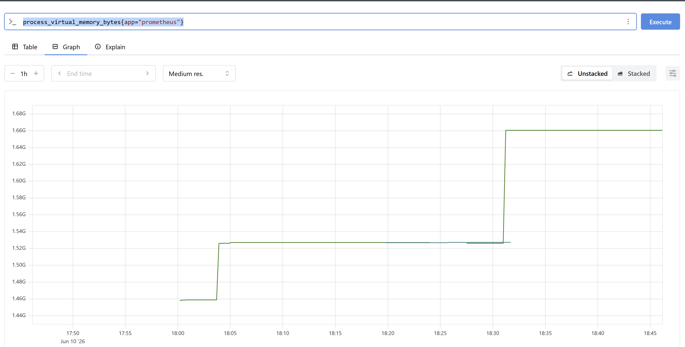

# Introduction lab exercises

Welcome to the Prometheus Foundation lab exercises. Throughout these exercises, participants will engage in a series of practical tasks and activities designed to build hands-on experience and develop key observability skills. Attendees will have the opportunity to explore, experiment, and deepen their understanding of modern observability concepts and practices, with a particular focus on Prometheus.

The goal of these lab exercises is to actively engage with the material and ask questions whenever something is unclear or you encounter a blocker. It is important to note that there are no strict dependencies between the labs, so it is perfectly fine to progress at your own pace, even if you fall behind on a particular exercise.

The following key topics are covered throughout these exercises:

- Deploy and configure Prometheus playground
- Working with expressions

## Exercise 1 - Deploy Prometheus playground

This exercise you are going to deploy the foundation of your playground. Foundation are the core `Prometheus` components without any configuration. The following components are included:

- Prometheus Server
- Alertmanager
- Pushgateway
- Prometheus Node Exporter
- Prometheus Blackbox Exporter

Here you can find the [compose.yml](./content/playground/compose.yml) and the complete [playground](./content/playground/) folder.

### Exercise 1.1 - Prepare the playground structure

First copy the `playground` folder to a location, such as your home folder. Ensure that you are in the repository root folder!

```
cd labs/03-PrometheusFoundation/content
cp -r playground ~
cd ~
mv playground prometheus-playground
```

Now that you have your own `Prometheus playground` you can create your own personal `.env` file. This environment file is important for Docker or Podman to successfully configure the containers.

```
cp .env-example .env
docker compose up -d
```

Initial startup takes a while due the fact all image layers need to be downloaded first.

> [!NOTE]  
> You may notice that during the start that some containers are in an error state. This is intentional, as you will configure and resolve these issues in later exercises.

### Exercise 1.2 - Configure your Prometheus playground

During the tasks below you are going to configure `Prometheus` *global settings* and create two *scrape_configs* for `prometheus` and `node-exporter`. You can add this configuration to the `~/prometheus-playground/config/prometheus/prometheus.yml` file.

- Set both the *global* *scrape_interval* and *evaluation_interval* to 15 seconds.
- Ensure the following scraping_configs are added.
    - Create a job called 'prometheus' that has 'prometheus:9090' as target and  *app: "prometheus"* as label.
    - Create a second job called 'node-exporter' that has 'node-exporter:9100' as target and  *app: "node-exporter"* as label.

Now complete the following tasks:
- Validate the `docker ps` if you see at least three of the five containers running. 
- Add the configuration to the `prometheus.yml` file and restart the container using `docker restart prometheus`.
- Open now the `Prometheus UI` within your favorite browser on `http://127.0.0.1:9090`and validate if the targets are available.

Now answer the following questions:
- Use expression **prometheus_target_scrape_pool_targets** to see all active scraping targets. Do you see both configured *targets*?
- What is the values of both the `job` and `instance` labels? You just have learned these are *reserved target* labels.
- What happens if you add an additional label to the prometheus *scraping job*? For example "student: "yourname"*,  restart prometheus again and run again the expression **prometheus_target_scrape_pool_targets**.

## Exercise 2 - Working with expressions

This exercise you will start execution expressions using the `Expression browser`. You maybe are familiar with Grafana, but it's good to learn the concept of basic `PromQL` queries.

### Exercise 2.1 - Basic filtering

This exercise you are going to learn about basic filtering. Filter the following using the `Expression browser` and use either *Explore metrics* or *autocomplete* feature.

You are going to inspect the virtual memory usage of our Prometheus App.

Use the metric called **process_virtual_memory_bytes** and filter only for the label app="prometheus". Inspect both *Table* and * *Graph*. 

The quwry you should build looks like `process_virtual_memory_bytes{app="prometheus"}`. 

### Exercise 2.2 - Regex based filtering

Some situations you need to find a certain match. Prometheus supports RegEx based filtering. Which can be halpful to get all '/api.' metrics that didn't succeed.

- Use the metric called **prometheus_http_requests_total**.
- Filter that only handlers are shown that start with `/api`.
- Only show metric values that didn't succeed, so (code not equal to 200).

The quwry you should build looks like `prometheus_http_requests_total{handler=~"/api/.*", code!="200"}`.

### Exercise 2.3 Metric types in action

During the module you have learned about the various `metric types`.  This exercise you are going to do some simple tasks to get familiar with each type.

Now complete the following tasks:
- Use *Explore metrics*. Which metric type do you see the most?
- Special *Gauge* is **node_os_info** this always has value '1'. Purpose is to use this in complex queries like `node_os_info{version_id="42"} == 1`. Give it a try yourself!
- What is the metric type of **node_cpu_seconds_total**? You can use *Explore metrics*...
- Take a look at **prometheus_http_response_size_bytes_sum**. This is a *histogram*. Try to display the rate of the last 5m.
- *Summary* is the last metric type, which is mainly used by Prometheus. You can query **prometheus_target_interval_length_seconds**.  You may recognize a *Summary* by the *quantile* label. Try to filter on the "0.99" quantile.

## Next Steps

You are ready to start with the next lab about [Prometheus Intrumentation](../04-PrometheusInstrumentation/README.md) for Prometheus OSS. Be aware that the trainer might have to explain the training material and provide additional instructions for a jump start.

Enjoy the exercises!!!
